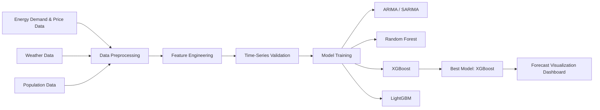

# Ontario Energy Forecasting Dashboard

A data science project for forecasting Ontario's hourly electricity demand and average energy price using historical energy records, climate data, and population trends.

## Project Overview

This project builds a forecasting pipeline for Ontario's energy system by combining three types of data:

- **Electricity demand and price data** from 2003 to 2023
- **Hourly weather data** from 10 Ontario weather stations
- **Quarterly population data** for Ontario

The goal is to improve energy demand and price prediction by using external factors such as temperature, humidity, seasonal patterns, and population growth. Several forecasting models were compared, including ARIMA, SARIMA, Random Forest, XGBoost, and LightGBM.

## Project Workflow



## Key Features

- Cleaned and merged large-scale time-series datasets from multiple sources
- Handled missing values using forward fill, backward fill, and interpolation
- Engineered time-based and lag features to capture seasonal demand patterns
- Compared traditional time-series models with machine learning models
- Used chronological train-test splitting and rolling time-series cross-validation
- Built visualizations for demand trends, price changes, seasonal effects, and model performance
- Developed a dashboard-style interface for presenting forecasting results

## Dataset

| Data Type | Description | Time Range |
|---|---|---|
| Energy Demand & Price | Hourly Ontario electricity demand and average price | 2003-2023 |
| Weather Data | Temperature, humidity, wind speed, wind chill, and other climate variables from 10 stations | 2003-2023 |
| Population Data | Quarterly Ontario population estimates | 2003-2023 |

## Models Used

| Model | Purpose |
|---|---|
| ARIMA | Traditional univariate time-series forecasting |
| SARIMA | Seasonal time-series forecasting |
| Random Forest | Machine learning regression model |
| XGBoost | Gradient boosting model for demand and price forecasting |
| LightGBM | Efficient gradient boosting model for large datasets |

## Results Summary

XGBoost achieved the best overall performance in this project. Machine learning models performed better than traditional ARIMA-based methods because they could use external features such as weather and population data.

| Model | Accuracy |
|---|---:|
| XGBoost | 92.4% |
| LightGBM | 89.7% |
| Random Forest | 88.5% |
| ARIMA | 74.2% |

## Main Findings

- Energy demand in Ontario is strongly affected by seasonality and extreme weather.
- Winter demand is generally higher because of heating needs.
- Population growth contributes to long-term increases in electricity consumption.
- Lag features from previous years help capture recurring seasonal demand patterns.
- XGBoost provided the strongest balance between accuracy and robustness.

## Tech Stack

- Python
- Pandas
- NumPy
- Scikit-learn
- XGBoost
- LightGBM
- Statsmodels
- Matplotlib
- Seaborn
- Streamlit
- Selenium

## Suggested Repository Structure

```text
ontario-energy-forecasting/
├── data/                  # Raw and processed datasets
├── notebooks/             # EDA and model experiments
├── src/                   # Data processing and modeling scripts
├── app.py                 # Streamlit dashboard
├── requirements.txt       # Python dependencies
└── README.md              # Project documentation
```

## How to Run

```bash
# Clone the repository
git clone <your-repository-url>
cd ontario-energy-forecasting

# Create and activate a virtual environment
python -m venv .venv
source .venv/bin/activate   # macOS/Linux
# .venv\Scripts\activate    # Windows

# Install dependencies
pip install -r requirements.txt

# Run the dashboard
streamlit run app.py
```

## Future Improvements

- Add real-time smart meter or IoT energy data
- Extend the model to other Canadian provinces
- Add carbon emission forecasting
- Improve dashboard interactivity
- Deploy the dashboard online for public access

## Project Summary

This project demonstrates how climate and population data can improve electricity demand forecasting. By combining multiple data sources and comparing different forecasting models, the system provides a practical approach for energy planning, grid management, and sustainable infrastructure development in Ontario.
