# Ontario Energy Forecasting Dashboard

## Project Demo Video

<video src="./videoplayback.mp4" controls width="100%">
  Your browser does not support the video tag.
</video>

> Click the image above to watch the project demo video on YouTube.

---
A data science project for forecasting **Ontario's hourly electricity demand and average electricity price** using historical energy records, climate data, and population trends.

This repository demonstrates a complete forecasting workflow, including data collection, preprocessing, feature engineering, time-series validation, model comparison, and dashboard-style visualization.

---

## Project Overview

Ontario's electricity demand is affected by several real-world factors, such as seasonal weather changes, extreme temperature events, and long-term population growth. Traditional time-series models can capture historical patterns, but they often struggle to use external variables such as temperature, humidity, and demographic trends.

This project addresses that problem by combining multiple data sources and comparing classical forecasting models with machine learning models.

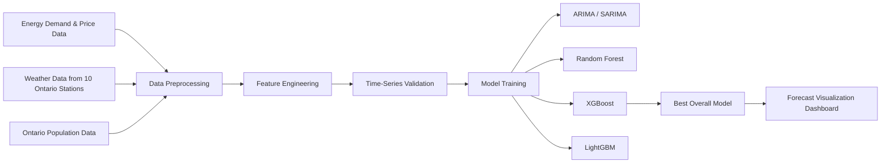

---

## Project Positioning

The project focuses on an Ontario-specific forecasting task and uses highly relevant external features, including weather and population data.

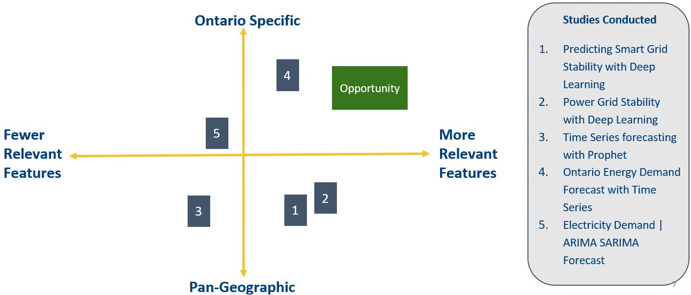

---

## Dataset

| Data Source | Description | Time Range |
|---|---|---|
| Energy demand and price | Hourly Ontario electricity demand and market price | 2003-2023 |
| Weather data | Hourly climate variables from 10 Ontario weather stations | 2003-2023 |
| Population data | Quarterly Ontario population estimates | 2003-2023 |

Key variables include:

- Hourly energy demand
- Hourly average electricity price
- Temperature
- Humidity
- Wind speed
- Wind chill
- Population estimates
- Date and time features
- Lag-based demand features

---

## Exploratory Data Analysis

The historical demand curve shows strong seasonality and repeated long-term patterns.

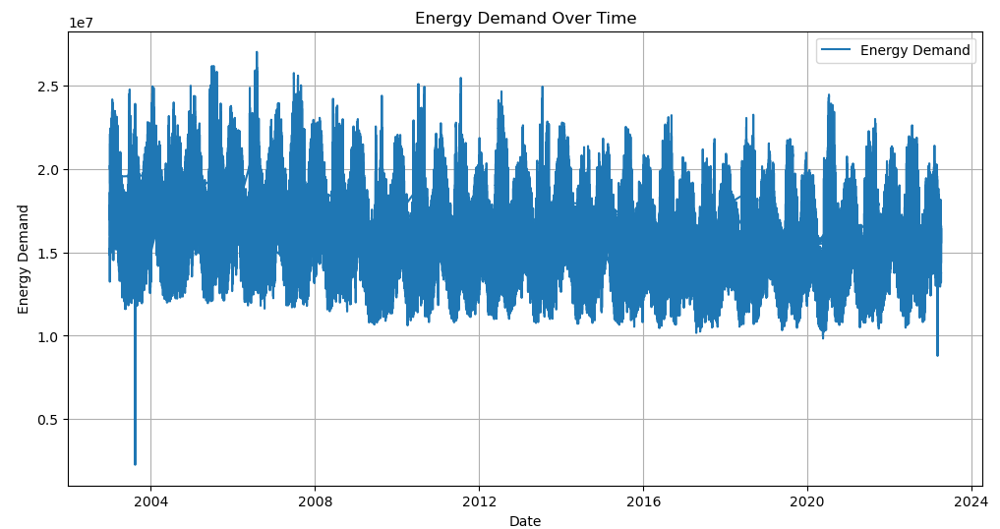

Electricity prices also show clear spikes during some periods, especially around high-demand conditions.

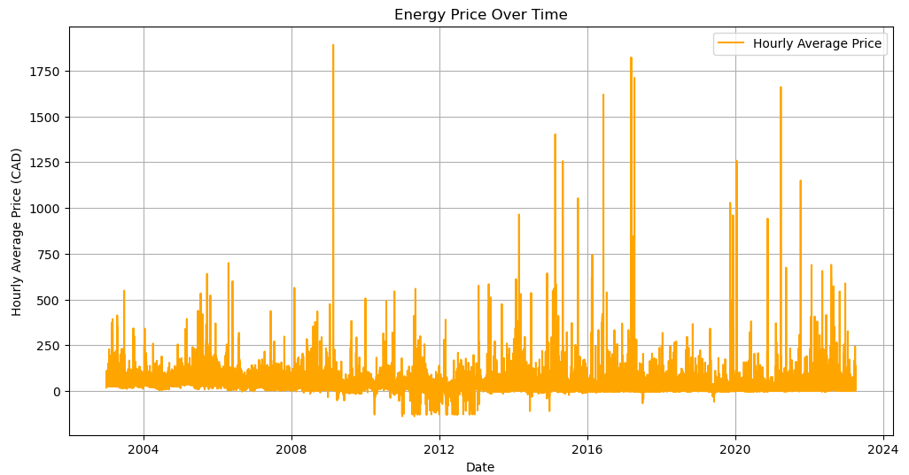

Seasonal analysis shows that winter demand is generally high, likely because of heating needs.

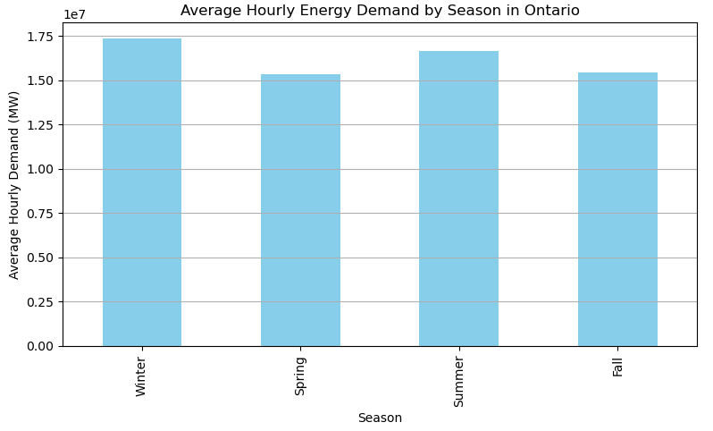

Extreme weather conditions are important because both very cold and very hot periods can increase electricity usage.

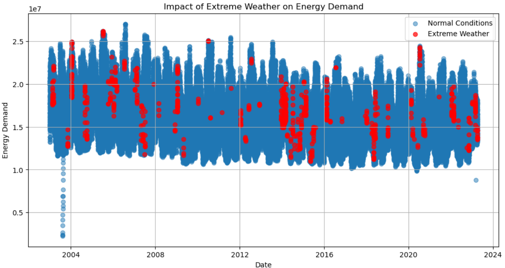

Population growth is another long-term factor that influences electricity consumption.

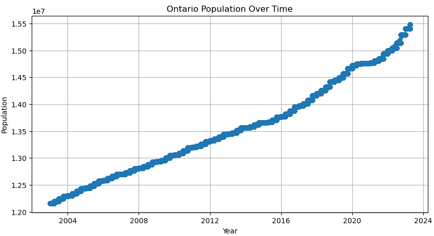

Monthly temperature patterns help explain seasonal changes in energy demand.

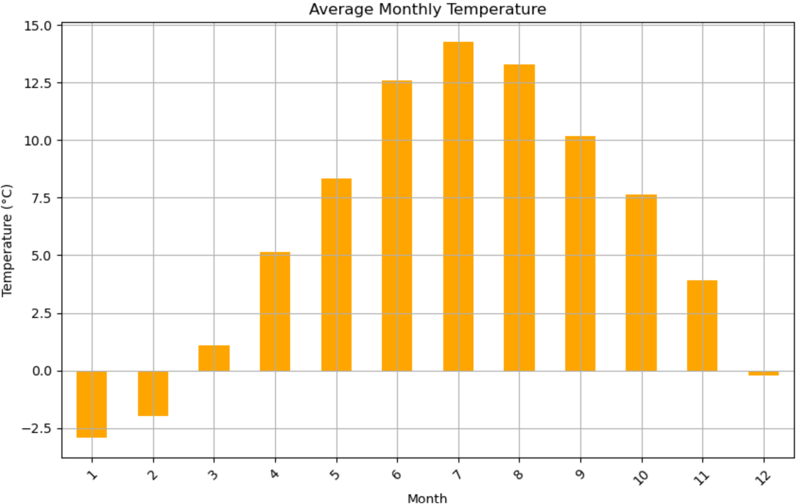

The variable distributions show the shape of demand, temperature, and population data used in the forecasting pipeline.

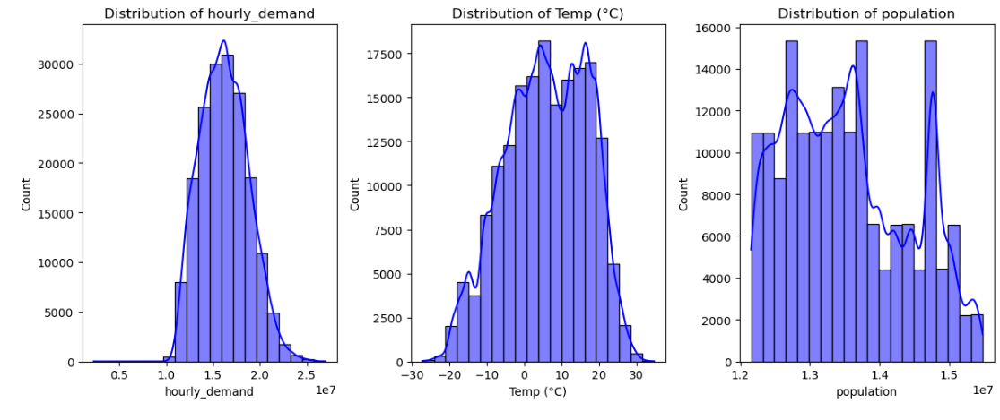

---

## Feature Engineering

The model uses both raw and engineered features. Important engineered features include:

- Hour of day
- Day of week
- Month
- Year
- Day of year
- Lag demand from previous years
- Moving and seasonal indicators
- Weather-based variables
- Population trend variables

Mutual information analysis showed that hourly demand, population, wind chill, temperature, and time-based variables were useful for prediction.

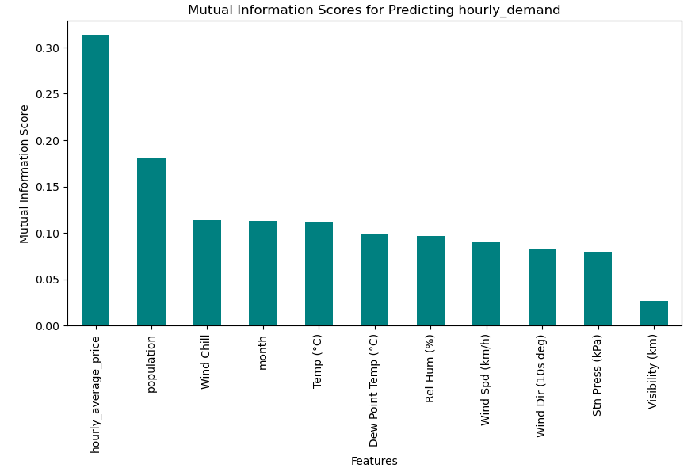

---

## Modeling Strategy

The data was split chronologically to avoid using future information during training.

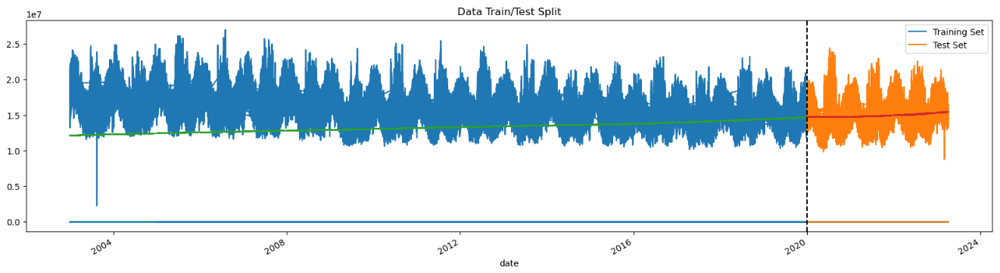

A rolling time-series cross-validation strategy was used to evaluate model generalization across multiple future periods.

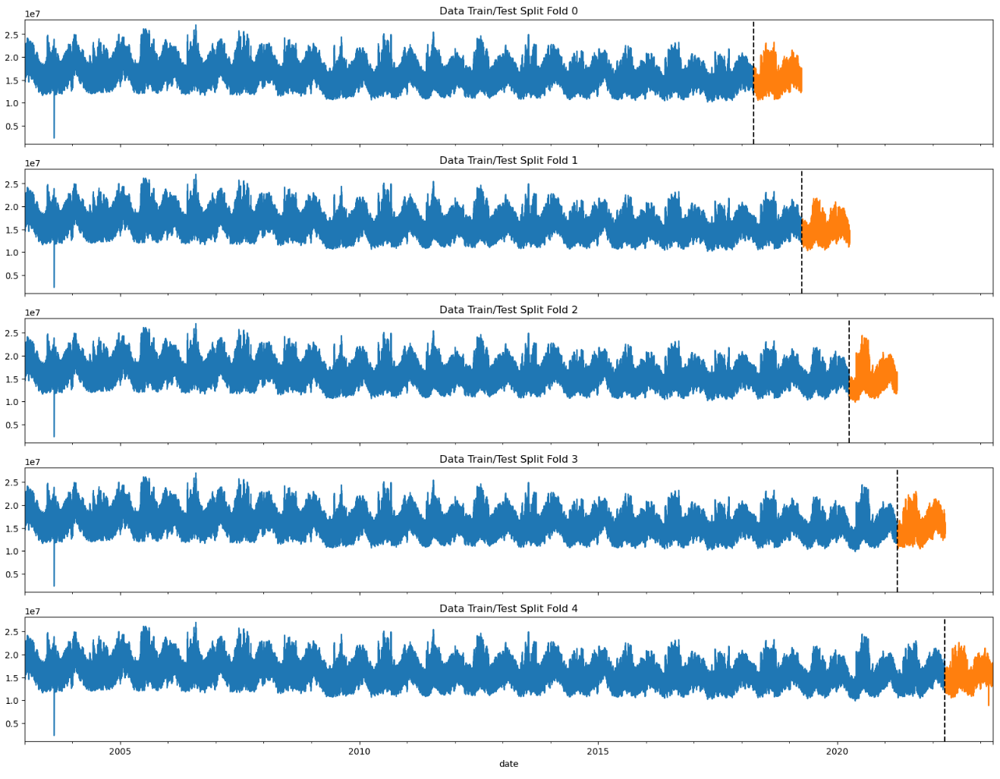

The actual vs predicted plots show that the XGBoost model follows the overall demand pattern well across validation folds.

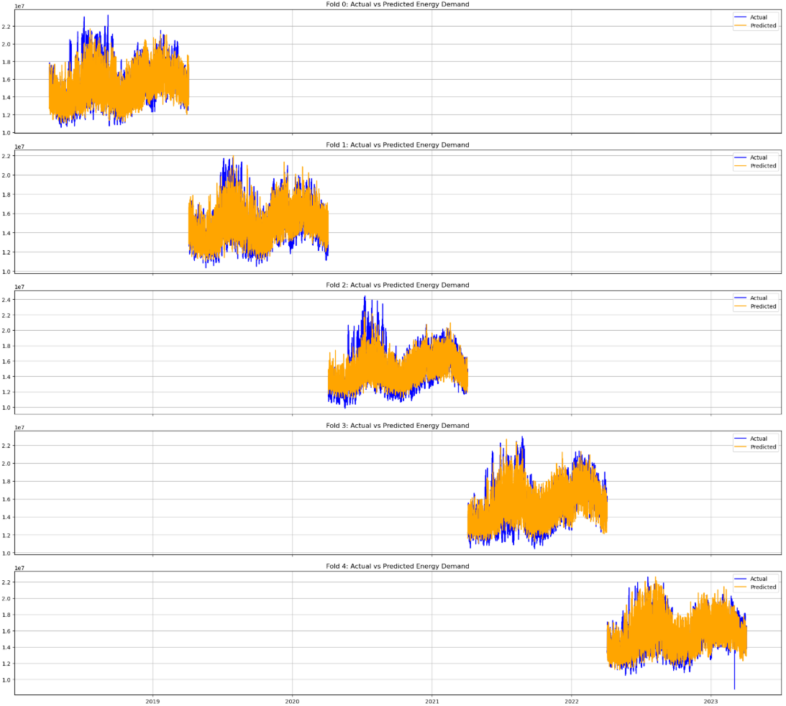

---

## Models Compared

| Model | Type | Main Purpose |
|---|---|---|
| ARIMA | Classical time-series model | Univariate demand forecasting |
| SARIMA | Seasonal time-series model | Seasonal demand forecasting |
| Random Forest | Machine learning model | Demand and price prediction |
| XGBoost | Gradient boosting model | Main high-performance forecasting model |
| LightGBM | Gradient boosting model | Efficient large-scale forecasting model |

ARIMA and SARIMA were useful as traditional baselines, but they were less effective at handling external features.

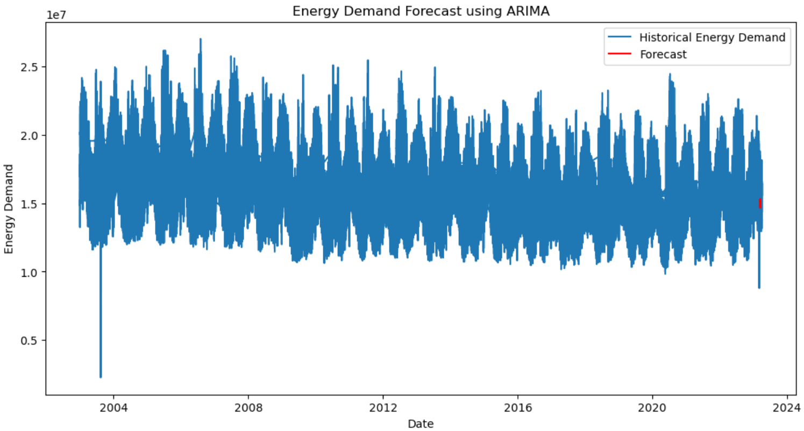

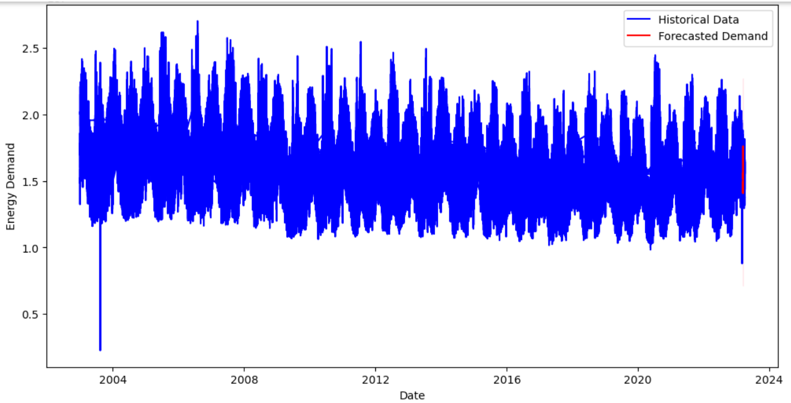

Machine learning models were better at capturing complex relationships between demand, price, weather, and population.

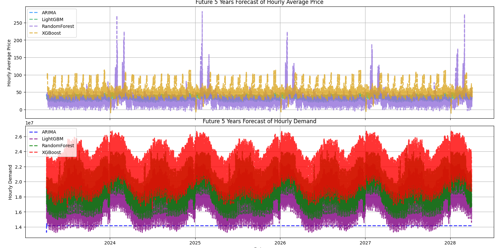

---

## Results

XGBoost achieved the best overall accuracy among the compared models.

| Model | Accuracy |
|---|---:|
| XGBoost | 92.4% |
| LightGBM | 89.7% |
| Random Forest | 88.5% |
| ARIMA | 74.2% |

The radar chart compares classification-style metrics, including accuracy, precision, recall, and F1-score.

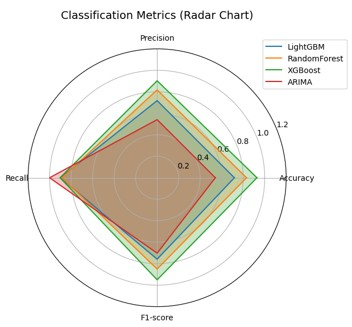

The error heatmaps compare log-transformed MSE, RMSE, and MAE for demand and price prediction.

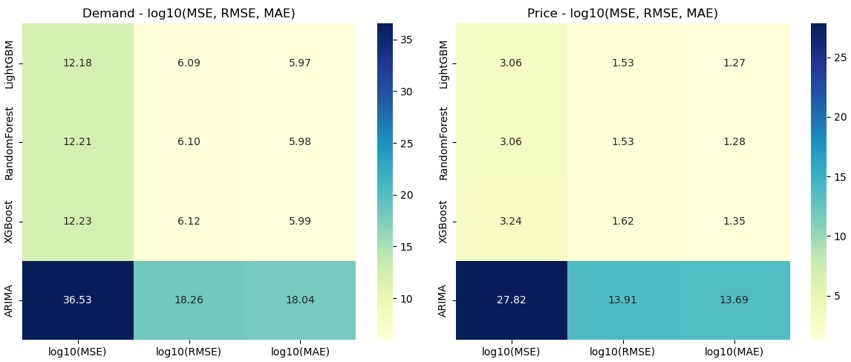

---

## Main Findings

- Energy demand in Ontario has strong seasonal patterns.
- Weather conditions, especially temperature-related variables, are important for demand forecasting.
- Population growth contributes to long-term demand changes.
- Lag features help the model learn recurring annual patterns.
- Machine learning models outperform traditional ARIMA-based models.
- XGBoost provides the strongest overall performance in this project.

---

## Tech Stack

- Python
- Pandas
- NumPy
- Scikit-learn
- XGBoost
- LightGBM
- Statsmodels
- Matplotlib
- Seaborn
- Selenium
- Streamlit

---

## Suggested Repository Structure

```text
ontario-energy-forecasting/
├── data/
├── notebooks/
├── src/
├── app.py
├── requirements.txt
├── README.md
├── project_positioning.png
├── hourly_energy_demand.png
├── hourly_energy_price.png
├── seasonal_energy_demand.png
├── extreme_weather_demand.png
├── population_trend.png
├── monthly_temperature.png
├── variable_distributions.png
├── mutual_information_features.png
├── chronological_train_test_split.png
├── time_series_cross_validation.png
├── actual_vs_predicted_folds.png
├── arima_forecast.png
├── sarima_forecast.png
├── five_year_model_comparison.png
├── classification_metrics_radar.png
└── error_metrics_heatmap.png
```

---

## How to Run

```bash
# Clone the repository
git clone <your-repository-url>
cd ontario-energy-forecasting

# Create a virtual environment
python -m venv .venv

# Activate the virtual environment
source .venv/bin/activate      # macOS/Linux
# .venv\Scripts\activate       # Windows

# Install dependencies
pip install -r requirements.txt

# Run the Streamlit dashboard
streamlit run app.py
```

---

## Future Improvements

- Add real-time smart meter or IoT data
- Extend the forecasting system to other Canadian provinces
- Add carbon emission forecasting
- Improve dashboard interactivity
- Deploy the dashboard online for public use

---

## Project Summary

This project shows how climate and population data can improve electricity demand and price forecasting. By combining multiple data sources with machine learning models, the system provides a practical forecasting tool for energy planning, grid management, and sustainable infrastructure development in Ontario.
